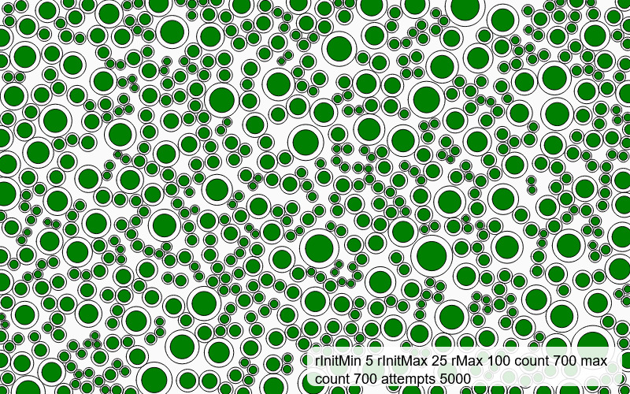
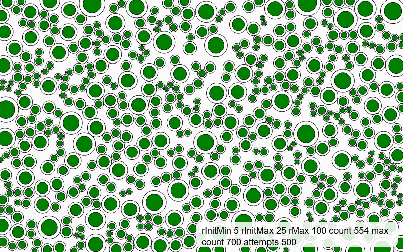
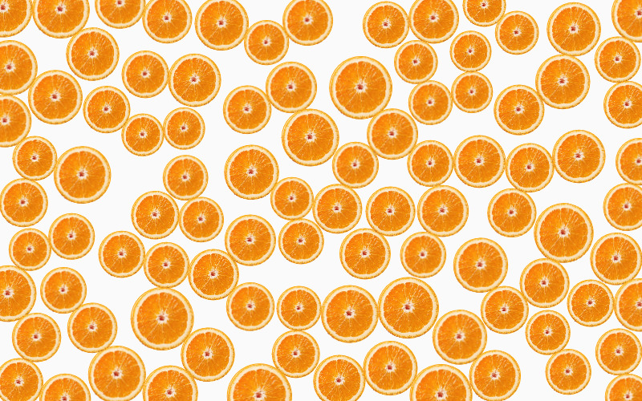

# p5-circle-packing

A p5.js circle packing generator.

## Use via `<script>` (no npm)
```html
<script src="https://cdnjs.cloudflare.com/ajax/libs/p5.js/1.9.3/p5.min.js"></script>
<script src="https://jesmehta.github.io/p5-circle-packing/CirclePack.js"></script>
<script>
  const foam = CirclePacking.getCirclePacking(20, 25, 75, 1000, 50);
</script>
````

A circle packing function that returns a canvas full of tangentially touching circles.  

## Input parameters :    

````
function getCirPack(minInitRadius, maxInitRadius, circleCount, maxAttempts, maxFinalRadius)
````

The function takes the following parameters :  

**Initial diameter : minInitRadius, maxInitRadius**  
These two parameters define a range for the starting ~radius~ diameter, actually. The actual diameter for each circle is a random value between these two values.

**Number of circles : circleCount**  
Specifies the max number of individual circles to be generated. This limit may not be reached, and you can specify a significantly high number to make sure a maximum possible number of circles is generated.

**How hard to try finding spaces : maxAttempts**  
Specifies the number of attempts to try to find a viable location for each new circle before giving up. A high enough number ensures best possible packing, while low numbers give you a spaced out result.

**Final diameter : maxRadius**  
The size of the circle at which it is flagged to stop growing any more. If the value is large, it removes an upper limit to the circle's growth, but the actual limit may never be reached.

## Outputs
Catch the output in a variable to use it further  
````
let foam = CirclePacking.getCirclePacking(20, 25, 75, 1000, 50);
````

The variable `foam` now contains a list of circle objects, each with the following properties  

**Location : x, y**  
**Size : bubRadius**  

Access these and use them further by cycling through the list using a for loop.

## Examples
Effects of changing parameters on the outcome. All parameters are "large" or "small" relative to the canvas size. The same parameters on a different canvas size will give very different resukts.

Green circles are default, while red circles are those that have reached `maxRadius`  

The parameters are listed in the images.


- No variation in starting size,  
- little difference in initial and final size, and 
- a reachable final count  
gives a mostly uniform field with spaces.

---
  
  
  
  
- No variation in starting size,  
- little difference in initial and final size, and 
- a very large (and unreachable) final count  
gives a very uniform field with no spaces.  

The rMax parameter makes little difference in the above two examples since the circle count itself is so high that the packed circles will never reach the upper limit.

---


- No variation in starting size,  
- Larger difference in initial and final sizes,  
- small final count,  
gives a more varying field, a mix of large and small circles, with more spaces.  

---


- Greater variation in starting size,  
- Larger difference in initial and final sizes,  
- small final count,  
gives a more varying field, a mix of large and small circles, with more spaces.  

---


- Greater variation in starting size,  
- Larger difference in initial and final sizes,  
- very small final count,  
gives a more varying field, a mix of large and small circles, with more spaces.  

---

In the following 4 examples, all other parameters being the same, the effect of the maxAttempts parameter is seen - the field grows lesser in density and the final count of circles reduces since the algorithm gives up faster.  





---

An interesting result, when the max initial size and the max final size are close values, while there is a wide range in the initial starting values.  


## Applications

The primary function, `getCirPack()` generates and returns a field of tangentially touching circles.
The array that it returns can also be further used to do create other packing shapes at that location and size.
The properties of the objects in the array can also be manipulated to create other visuals.

Nested circles within the packing.  


Polygons instead of circles.  


Images instead of circles.  
[](./examples/CirPack%20v2.20%20CirPack%20images/)



## Credits and acknowledgements

Dan Shiffman over at the Coding Train, whose Coding Challenges first introduced me to the concept of packing circles. His example was my first time playing with packing and it's results. While my algorithm and code are a different approach, I'd like to credit him and thank him simply for the wonderful world of processing and p5 that he opens up to everyone.

Saber Khan, who organises CCFest; this version of the circle packing approach had been languishing in my files for a couple of years atleast. it was finally when preparing to take a workshop at CCFest that I finally decided that this was better off published and public.

It is absolutely a micro-library with more-or-less one single function and purpose, but it's my first code contribution, and I am rather pleased with myself.


#ToDo

- actual example files upload
- svg export example, create, upload
- links to Dan, Saber, etc
- jsdeliver link